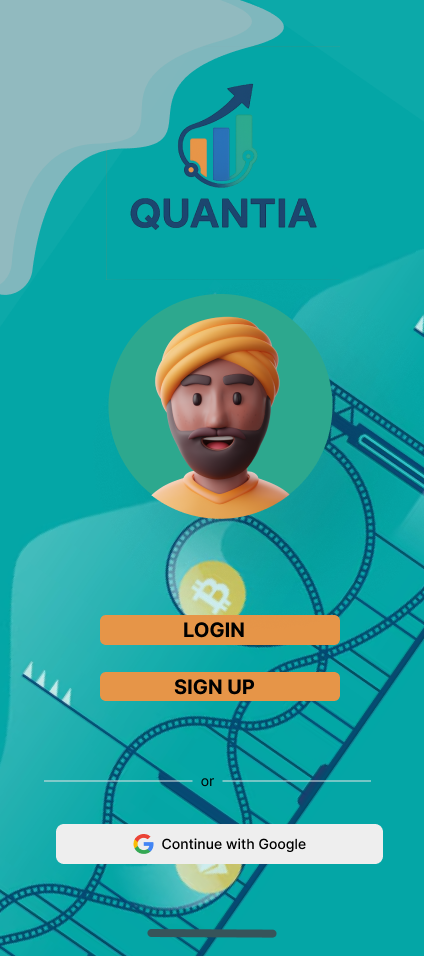

# 💸 QUANTIA  
### Tu asesor digital de inversiones impulsado por Inteligencia Artificial  

> 🌟 *Empoderamos tus decisiones financieras con educación, transparencia y tecnología inteligente.*

---

## 🖥️ Vista del Proyecto

🎨 **Versión web oficial del proyecto:**  
📍 `https://1asi0385-2520-4036-g5-quantia.github.io/Trabajo-Final/`

*(Ejemplo visual del diseño de la landing page y su interfaz educativa y financiera.)*

---

## 🧩 ¿Qué es Quantia?

**Quantia** es una startup **fintech peruana** que busca transformar la manera en que las personas invierten.  
Combina **IA adaptativa**, **educación financiera accesible** y una **gestión de portafolio integral** para que cualquier persona, sin importar su experiencia, pueda invertir con seguridad, claridad y confianza.  

> 💬 “Invertir con confianza empieza con entender lo que haces.”

---

## 🎯 Objetivo del Proyecto

Ayudar a **jóvenes profesionales** e **inversionistas principiantes** a invertir de forma **segura e informada**, brindándoles una app que **enseña, guía y analiza** cada paso.

---

## 🧠 Características Principales

| 🔹 Funcionalidad | 💡 Descripción |
|------------------|----------------|
| 🔐 **Seguridad avanzada** | Inicio de sesión, autenticación 2FA y control de accesos. |
| 💰 **Inversiones inteligentes** | Recomendaciones con IA según tu perfil, riesgo y metas. |
| 📊 **Monitoreo en tiempo real** | Dashboard con alertas inteligentes y rendimiento del portafolio. |
| 🎓 **Educación integrada** | Microcontenidos y simuladores para aprender mientras inviertes. |
| ⚙️ **Gestión de fondos** | Depósitos, retiros y conversión con total transparencia. |

---

## 👥 Segmentos Objetivo

👩‍💼 **Jóvenes profesionales (25–30 años):**  
Buscan aprender a invertir y gestionar su dinero con responsabilidad.  

📱 **Inversionistas principiantes:**  
Desean orientación clara, práctica y libre de tecnicismos para tomar decisiones seguras.  

---

## 🧭 Diferenciadores de Quantia

| 🏆 Aspecto | 💎 Ventaja de Quantia |
|------------|----------------------|
| IA Adaptativa | Aprende del usuario y mejora sus recomendaciones. |
| Educación In-App | Enseña con ejemplos, simulaciones y contenido breve. |
| Multi-Activos | Acciones, fondos mutuos y criptomonedas en un solo lugar. |
| Transparencia Total | Comisiones visibles antes de invertir. |
| Seguridad | Encriptación, 2FA y políticas KYC claras. |

---

## 📈 Metas de Éxito

📊 **Indicadores Clave de Desempeño (KPIs):**

| Métrica | Meta |
|----------|------|
| 🚀 Usuarios completan onboarding educativo | ≥ 60% |
| 💸 Primeras inversiones dentro de 14 días | ≥ 30% |
| 🔁 Retención a 30 días | ≥ 35% |
| 🔐 Usuarios con 2FA activo | ≥ 50% |
| 🌟 Satisfacción (NPS) | ≥ 40 |

---

## 🎨 Diseño UX/UI

🖋️ La identidad visual de **Quantia** combina profesionalismo con accesibilidad:  

- **Colores:** Azul petróleo, blanco y dorado suave.  
- **Tipografía:** “Poppins” y “Righteous” (para títulos).  
- **Estilo:** Minimalista, limpio y moderno.  
- **Iconografía:** Líneas finas y gráficos simples para comprensión visual.  

📱 *Diseño responsivo disponible para desktop, tablet y mobile.*

---

## 🧑‍💻 Equipo de Desarrollo

| 👤 Integrante | 💼 Rol | 🎓 Carrera |
|---------------|--------|------------|
| **Angelina Barrientos Quispe** | UX/UI Designer — Landing Page & Wireframes | Ing. de Sistemas de Información |
| **Milenko Cayanchi Ávila** | UI/UX — Style Guidelines | Ing. de Software |
| **Schneider Delgado Carrasco** | UI Prototyping & Wireflow | Ing. de Software |
| **Jonatan Elías Rivera** | Product Backlog & Impact Mapping | Ing. de Sistemas de Información |
| **Pool Fernández Galarza** | Arquitectura de Información | Ing. de Sistemas de Información |
| **Carlos López Goitia** | Mobile UI Design & Mockups | Ing. de Software |
| **Manuel Molina Vásquez** | User Stories & To-Be Mapping | Ing. de Software |

---

## 🏗️ Tecnologías Utilizadas

💻 **Desarrollo Web:**  
HTML5 · CSS3 · JavaScript  

🧠 **Prototipado UX/UI:**  
Figma 

🛡️ **Seguridad:**  
2FA · Validación por correo · Cifrado de datos  

🧾 **Documentación:**  
Lean UX Canvas · User Stories · Product Backlog · Wireframes  

---

✨ *Hecho con dedicación por el equipo Quantia — UPC 2025*

